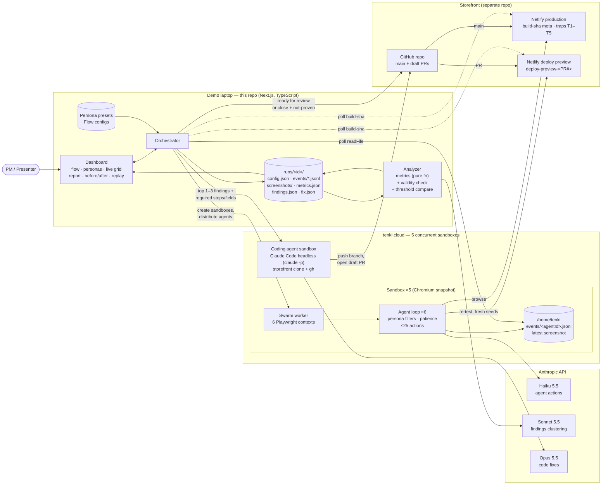
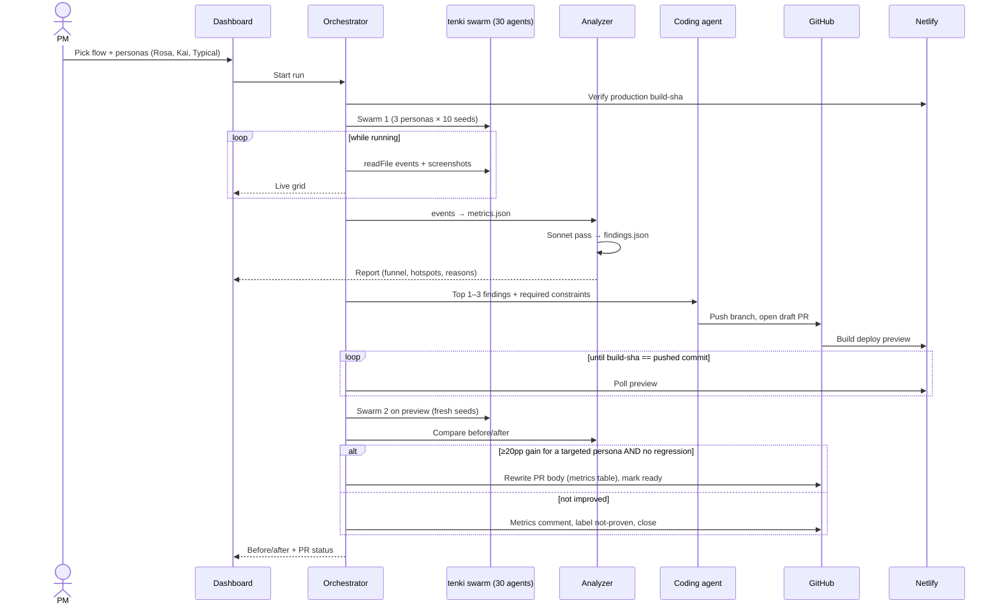

# FrictionSwarm — Architecture

Derived from `SPEC.md`.

## Components

```mermaid
flowchart LR
    PM([PM / Presenter])

    subgraph Laptop["Demo laptop — this repo (Next.js, TypeScript)"]
        Dash["Dashboard<br/>flow · personas · live grid<br/>report · before/after · replay"]
        Orch["Orchestrator"]
        Analyzer["Analyzer<br/>metrics (pure fn)<br/>+ validity check<br/>+ threshold compare"]
        Presets[("Persona presets<br/>Flow configs")]
        Runs[("runs/&lt;id&gt;/<br/>config.json · events/*.jsonl<br/>screenshots/ · metrics.json<br/>findings.json · fix.json")]
    end

    subgraph Tenki["tenki cloud — 5 concurrent sandboxes"]
        subgraph SB["Sandbox ×5 (Chromium snapshot)"]
            Worker["Swarm worker<br/>6 Playwright contexts"]
            Agents["Agent loop ×6<br/>persona filters · patience<br/>≤25 actions"]
            Files[("/home/tenki<br/>events/&lt;agentId&gt;.jsonl<br/>latest screenshot")]
        end
        Coder["Coding agent sandbox<br/>Claude Code headless (claude -p)<br/>storefront clone + gh"]
    end

    subgraph Anthropic["Anthropic API"]
        Haiku["Haiku 5.5<br/>agent actions"]
        Sonnet["Sonnet 5.5<br/>findings clustering"]
        Opus["Opus 5.5<br/>code fixes"]
    end

    subgraph Store["Storefront (separate repo)"]
        GH["GitHub repo<br/>main + draft PRs"]
        Prod["Netlify production<br/>build-sha meta · traps T1–T5"]
        Preview["Netlify deploy preview<br/>deploy-preview-&lt;PR#&gt;"]
    end

    PM --> Dash
    Dash <--> Orch
    Presets --> Orch
    Orch -->|create sandboxes,<br/>distribute agents| Worker
    Worker --> Agents
    Agents --> Haiku
    Agents -->|browse| Prod
    Agents -->|re-test, fresh seeds| Preview
    Agents --> Files
    Orch -->|poll readFile| Files
    Orch --> Runs
    Runs --> Analyzer
    Analyzer --> Sonnet
    Analyzer --> Runs
    Runs --> Dash
    Orch -->|top 1–3 findings +<br/>required steps/fields| Coder
    Coder --> Opus
    Coder -->|push branch,<br/>open draft PR| GH
    GH -->|main| Prod
    GH -->|PR| Preview
    Orch -.->|poll build-sha| Prod
    Orch -.->|poll build-sha| Preview
    Orch -->|ready for review<br/>or close + not-proven| GH
```

## Demo loop

```mermaid
sequenceDiagram
    actor PM
    participant D as Dashboard
    participant O as Orchestrator
    participant S as tenki swarm (30 agents)
    participant A as Analyzer
    participant C as Coding agent
    participant G as GitHub
    participant N as Netlify

    PM->>D: Pick flow + personas (Rosa, Kai, Typical)
    D->>O: Start run
    O->>N: Verify production build-sha
    O->>S: Swarm 1 (3 personas × 10 seeds)
    loop while running
        O->>S: readFile events + screenshots
        O-->>D: Live grid
    end
    O->>A: events → metrics.json
    A->>A: Sonnet pass → findings.json
    A-->>D: Report (funnel, hotspots, reasons)
    O->>C: Top 1–3 findings + required constraints
    C->>G: Push branch, open draft PR
    G->>N: Build deploy preview
    loop until build-sha == pushed commit
        O->>N: Poll preview
    end
    O->>S: Swarm 2 on preview (fresh seeds)
    O->>A: Compare before/after
    alt ≥20pp gain for a targeted persona AND no regression
        O->>G: Rewrite PR body (metrics table), mark ready
    else not improved
        O->>G: Metrics comment, label not-proven, close
    end
    O-->>D: Before/after + PR status
```
