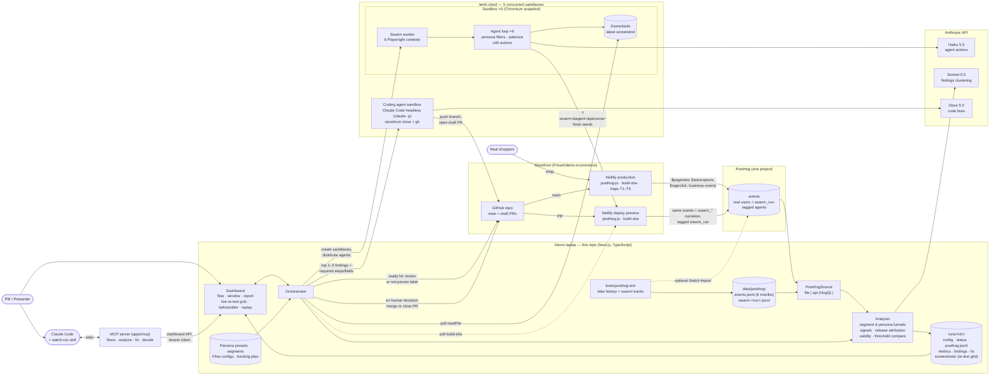
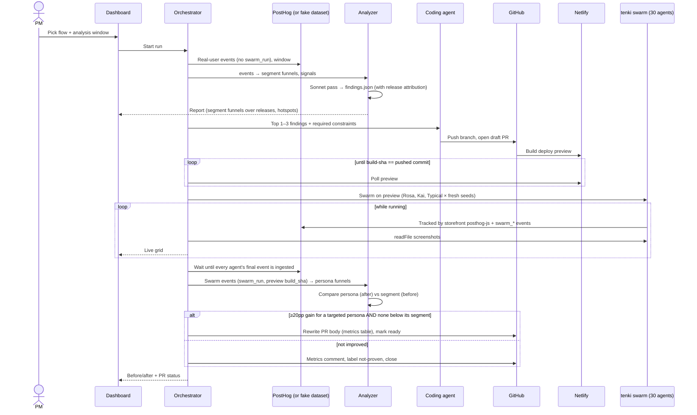

# FrictionSwarm — Architecture

Derived from `SPEC.md` (PostHog pivot: no baseline swarm; the swarm only re-tests the fix and leaves PostHog tracks).

## Components

```mermaid
flowchart LR
    PM([PM / Presenter])
    CC(["Claude Code<br/>+ watch-run skill"])
    MCP["MCP server (apps/mcp)<br/>flows · analyze · fix · decide"]
    Users([Real shoppers])

    subgraph Laptop["Demo laptop — this repo (Next.js, TypeScript)"]
        Dash["Dashboard<br/>flow · window · report<br/>live re-test grid · before/after · replay"]
        Orch["Orchestrator"]
        Source["PostHogSource<br/>file | api (HogQL)"]
        Analyzer["Analyzer<br/>segment & persona funnels<br/>signals · release attribution<br/>validity · threshold compare"]
        Presets[("Persona presets · segments<br/>Flow configs · tracking plan")]
        Fake[("data/posthog/<br/>events.jsonl (6 months)<br/>swarm-&lt;run&gt;.jsonl")]
        Sim["tools/posthog-sim<br/>fake history + swarm tracks"]
        Runs[("runs/&lt;id&gt;/<br/>config · status · posthog.jsonl<br/>metrics · findings · fix<br/>screenshots/ (re-test grid)")]
    end

    subgraph PH["PostHog (one project)"]
        PHE[("events<br/>real users + swarm_run-tagged agents")]
    end

    subgraph Tenki["tenki cloud — 5 concurrent sandboxes"]
        subgraph SB["Sandbox ×5 (Chromium snapshot)"]
            Worker["Swarm worker<br/>6 Playwright contexts"]
            Agents["Agent loop ×6<br/>persona filters · patience<br/>≤40 actions"]
            Shots[("/home/tenki<br/>latest screenshot")]
        end
        Coder["Coding agent sandbox<br/>Claude Code headless (claude -p)<br/>storefront clone + gh"]
    end

    subgraph Anthropic["Anthropic API"]
        Haiku["Haiku 5.5<br/>agent actions"]
        Sonnet["Sonnet 5.5<br/>findings clustering"]
        Opus["Opus 5.5<br/>code fixes"]
    end

    subgraph Store["Storefront (FrissA/demo-ecommerce)"]
        GH["GitHub repo<br/>main + draft PRs"]
        Prod["Netlify production<br/>posthog-js · build-sha · traps T1–T5"]
        Preview["Netlify deploy preview<br/>posthog-js · build-sha"]
    end

    PM --> Dash
    PM --> CC
    CC <-->|stdio| MCP
    MCP -->|dashboard API,<br/>bearer token| Dash
    Dash <--> Orch
    Presets --> Orch
    Users -->|shop| Prod
    Prod -->|$pageview, $autocapture,<br/>$rageclick, business events| PHE
    Sim --> Fake
    Sim -.->|optional /batch import| PHE
    PHE --> Source
    Fake --> Source
    Source --> Analyzer
    Analyzer --> Sonnet
    Analyzer --> Runs
    Orch --> Analyzer
    Runs --> Dash
    Orch -->|top 1–3 findings +<br/>required steps/fields| Coder
    Coder --> Opus
    Coder -->|push branch,<br/>open draft PR| GH
    GH -->|main| Prod
    GH -->|PR| Preview
    Orch -.->|poll build-sha| Preview
    Orch -->|create sandboxes,<br/>distribute agents| Worker
    Worker --> Agents
    Agents --> Haiku
    Agents -->|?swarm=&agent=&persona=<br/>fresh seeds| Preview
    Preview -->|same events + swarm_* narration,<br/>tagged swarm_run| PHE
    Agents --> Shots
    Orch -->|poll readFile| Shots
    Orch -->|ready for review<br/>or not-proven label| GH
    Orch -->|on human decision:<br/>merge or close PR| GH
```

## Demo loop

```mermaid
sequenceDiagram
    actor PM
    participant D as Dashboard
    participant O as Orchestrator
    participant P as PostHog (or fake dataset)
    participant A as Analyzer
    participant C as Coding agent
    participant G as GitHub
    participant N as Netlify
    participant S as tenki swarm (30 agents)

    PM->>D: Pick flow + analysis window
    D->>O: Start run
    O->>P: Real-user events (no swarm_run), window
    O->>A: events → segment funnels, signals
    A->>A: Sonnet pass → findings.json (with release attribution)
    A-->>D: Report (segment funnels over releases, hotspots)
    O->>C: Top 1–3 findings + required constraints
    C->>G: Push branch, open draft PR
    G->>N: Build deploy preview
    loop until build-sha == pushed commit
        O->>N: Poll preview
    end
    O->>S: Swarm on preview (Rosa, Kai, Typical × fresh seeds)
    loop while running
        S->>P: Tracked by storefront posthog-js + swarm_* events
        O->>S: readFile screenshots
        O-->>D: Live grid
    end
    O->>P: Wait until every agent's final event is ingested
    O->>A: Swarm events (swarm_run, preview build_sha) → persona funnels
    A->>A: Compare persona (after) vs segment (before)
    alt ≥20pp gain for a targeted persona AND none below its segment
        O->>G: Rewrite PR body (metrics table), mark ready
    else not improved
        O->>G: Metrics comment, label not-proven, close
    end
    O-->>D: Before/after + PR status
```
